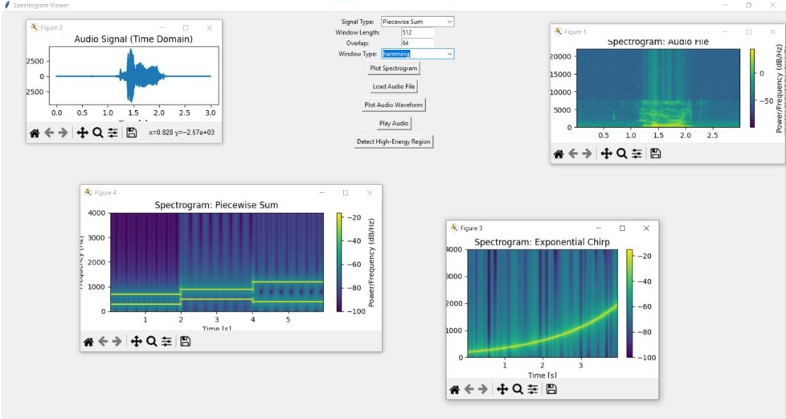
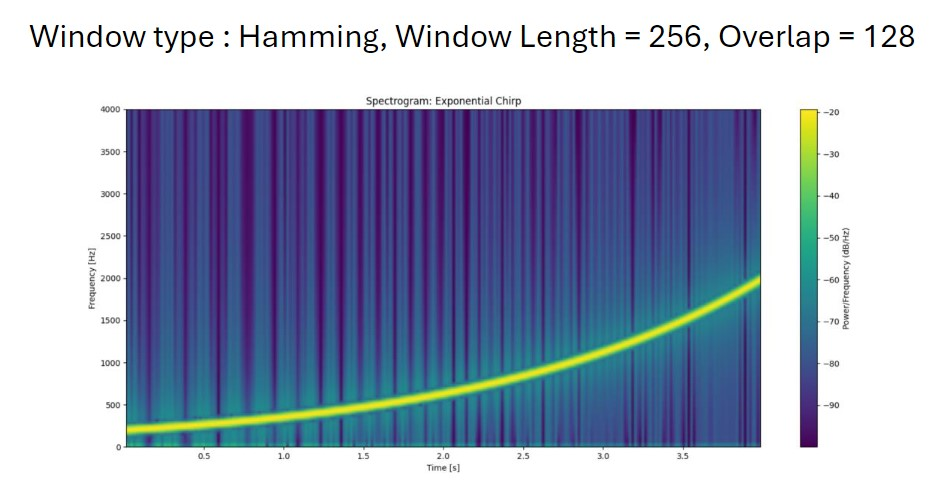
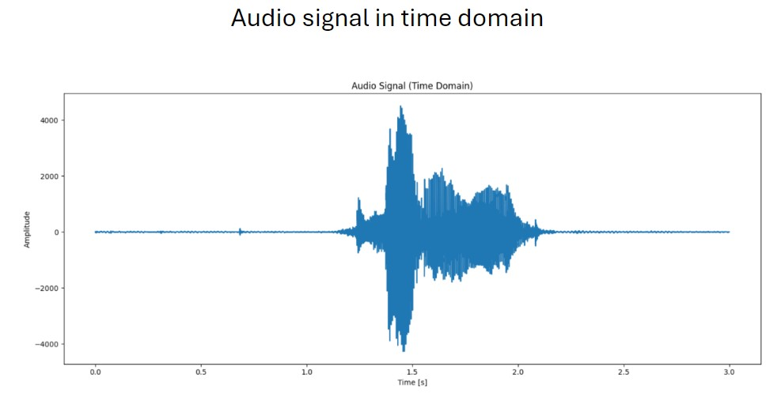
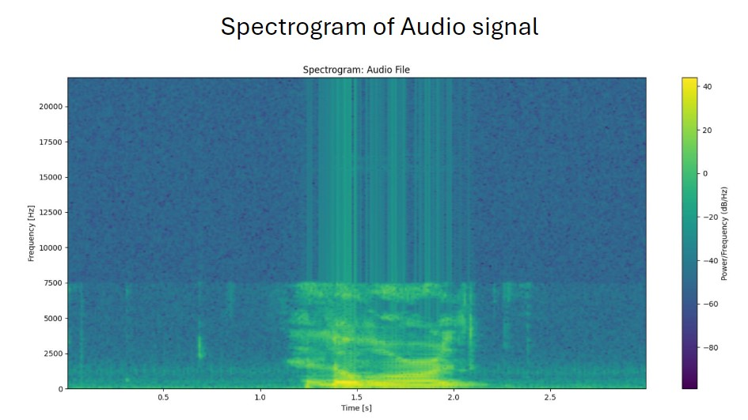

# Spectrogram Viewer GUI 🎵📊

This is a Python-based GUI application that allows users to visualize the **spectrogram** and **waveform** of various synthetic and real audio signals. The app is built using `Tkinter` for the GUI and `matplotlib` for visualizations. It also uses `scipy`, `numpy`, and `sounddevice` for signal processing and playback.

## 🚀 Features

- Select from various synthetic signals:
  - Linear Chirp
  - Exponential Chirp
  - Piecewise Sinusoid
  - Piecewise Sum of Sinusoids
- Load and analyze `.wav` audio files.
- Visualize **spectrogram** with adjustable parameters:
  - Window length
  - Overlap
  - Window type (Rectangular, Hamming, Hann)
- View waveform of loaded audio files.
- Play loaded audio using system sound.
- Detect high-energy regions in audio based on energy threshold.

## 🖼️ Screenshots

1. **Main GUI window**
   
2. **Spectrogram of a Linear Chirp**
   
3. **Waveform & Spectrogram view of an audio file**
   
   

## 🛠️ Installation

### 1. Clone the Repository

```bash
git clone https://github.com/yourusername/spectrogram-viewer.git
cd spectrogram-viewer
```

### 2. Install Dependencies

Make sure you have Python 3.8+ installed.

```bash
pip install numpy matplotlib scipy sounddevice
```

If you're using `tkinter` for the first time, it’s usually preinstalled with Python. If not:

- On Ubuntu/Debian:
  ```bash
  sudo apt-get install python3-tk
  ```
- On macOS:
  Tkinter should be included with the Python installer from [python.org](https://www.python.org/).

### 3. Run the App

```bash
python main.py
```

## 📁 Project Structure

```bash
.
├── app.py              # GUI logic and signal visualization
├── signals.py          # Synthetic signal generators
├── main.py             # App launcher
└── README.md           # You're here!
```

## 🎧 Usage Instructions

1. **Choose a Signal Type** from the dropdown.
2. **Set Parameters**:
   - Window Length (e.g., 256)
   - Overlap (e.g., 128)
   - Window Type (hann, hamming, rectangular)
3. **Click 'Plot Spectrogram'** to generate the frequency-time plot.
4. To work with real audio:
   - Click **Load Audio File**
   - View **Waveform**
   - Click **Play Audio**
   - Use **Detect High-Energy Region** to analyze loud sections.

## 📌 Notes

- Audio files must be `.wav` format.
- Stereo audio files will be downmixed to mono (first channel only).
- Energy thresholding in high-energy detection is based on 60% of the peak window energy.